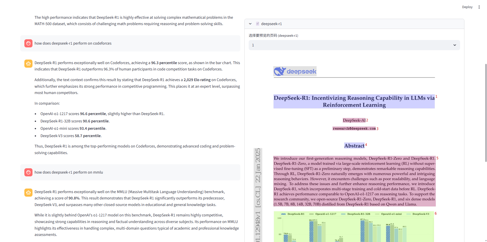
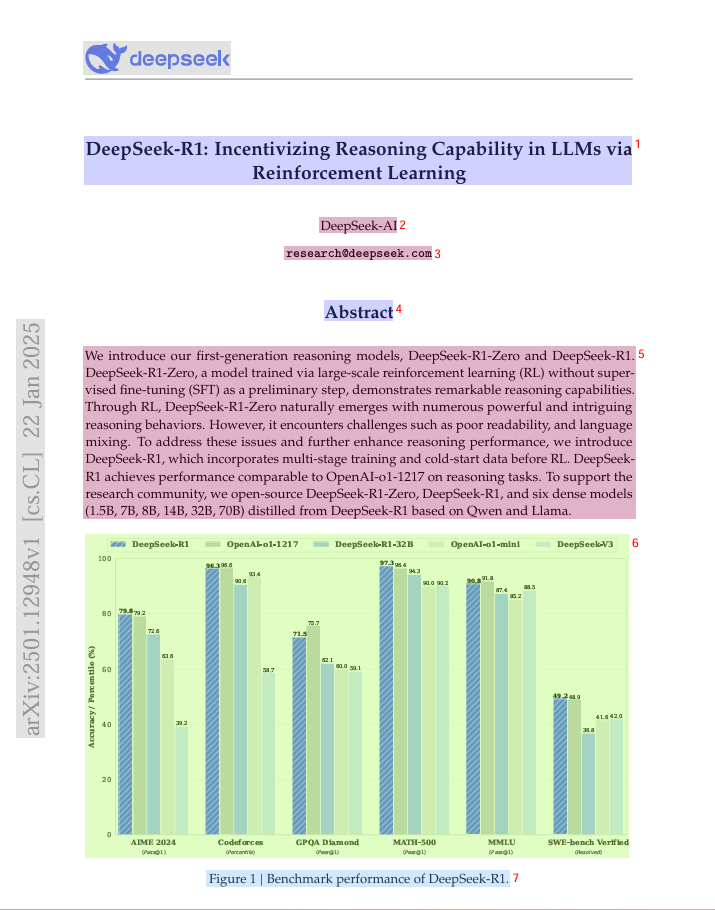
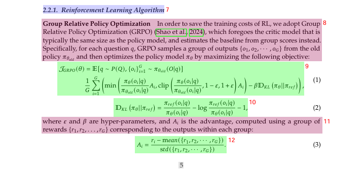
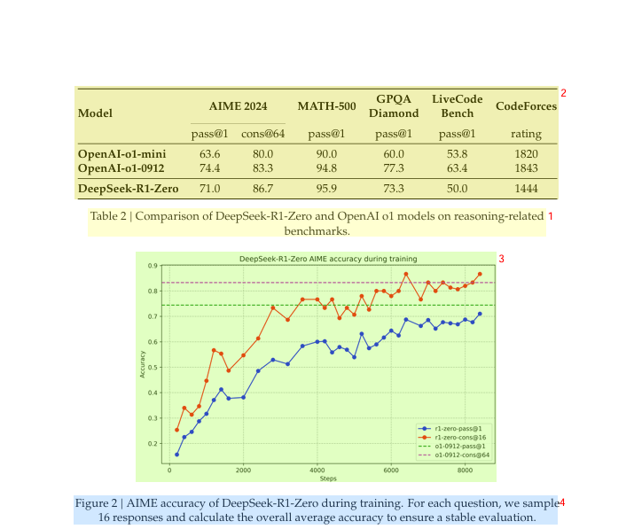

# 多模态RAG-ChatBot
本项目实现了一个多模态RAG系统, 支持图片/表格/公式等非结构化元素的识别、索引、查询, 主要用于进行技术类PDF文档的问答.


## 项目框架
(框图)

整体实现方案描述

## 多模态方案
通过MinerU解析PDF, 获取图片/表格/公式/文本等元素, 用VLM统一至文本模态进行索引和查询
* 图片: 通过VLM识别图片内容, 输出为文本描述, 用文本描述进行索引和查询, 生成回答时给VLM输入查询对应图片以丰富信息
* 表格/公式: 表格解析为markdown格式, 公式解析为latex格式, 可以直接作为文本进行索引和查询

MinerU的解析图片/公式/表格等多模态信息如下所示:




## 项目部署
```bash
# pdf预览依赖安装
sudo apt-get install poppler-utils
# MinerU安装
git clone https://github.com/opendatalab/MinerU.git
cd MinerU
uv pip install -e .[core]
mineru-models-download # 下载mineru依赖模型

# 其余依赖安装
pip install -r requirements.txt

# 运行RAG
streamlit run app.py
```

## 可优化的方案
* 根据层级进行总结, 提升对全局信息问答的准确率
* 根据分段提取QA对, 提升问答的准确率
* 图片/表格/公式分段时附带前后文本的相关内容, 提升召回段落的准确性
* 使用字面检索/HyDE等多路召回的方式提升召回率

## 参考资料