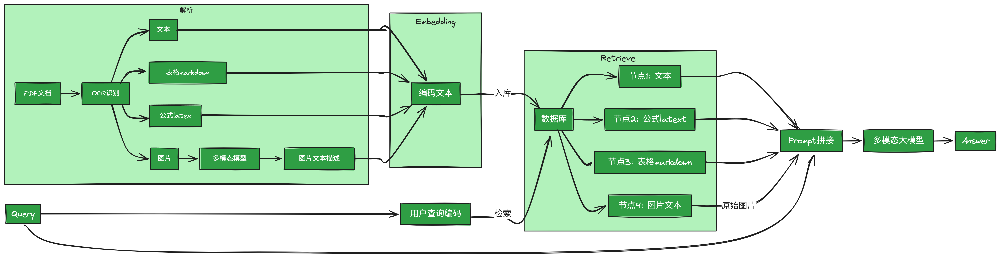

# 多模态RAG-ChatBot
本项目实现了一个多模态RAG系统, 支持图片/表格/公式等非结构化元素的识别、索引、查询, 主要用于进行技术类PDF文档的问答.


## 实现方案


主要思路是通过MinerU解析PDF, 获取图片/表格/公式/文本等元素, 用VLM统一至文本模态进行索引和查询
* 图片: 通过VLM识别图片, 输出文本描述, 用文本描述进行索引和查询. 在meta信息中保存图片的存储地址, 生成回答时给VLM输入原始图片
* 表格/公式: 表格解析为markdown格式, 公式解析为latex格式, 可以直接作为文本进行索引和查询

MinerU的解析图片/公式/表格等多模态信息如下所示:


## 项目部署
```bash
# MinerU安装
git clone https://github.com/opendatalab/MinerU.git
cd MinerU
uv pip install -e .[core]
mineru-models-download # 下载mineru依赖模型

# pdf预览依赖安装
sudo apt-get install poppler-utils

# 其余依赖安装
pip install -r requirements.txt

# 运行RAG
streamlit run app.py
```

## 可优化的方案
* 根据层级进行总结, 提升对全局信息问答的准确率
* 根据分段提取QA对, 提升问答的准确率
* 图片/表格/公式分段时附带前后文本的相关内容, 提升召回段落的准确性
* 使用字面检索/HyDE等多路召回的方式提升召回率

## 参考资料
* [MinerU](https://github.com/opendatalab/MinerU) 是一个非常强力的PDF解析工具, 可以将PDF中的文本/图片/表格/公式提取为markdown/json等通用格式, 便于后续RAG系统设计.
* [阿里云百炼](https://bailian.console.aliyun.com/) 提供了LLM/VLM/Embedding/Reranking等一系列常用的模型, 且兼容OpenAI api接口的模型, 便于RAG系统的快速开发和验证.
* [streamlit](https://github.com/streamlit/streamlit) 方便Python快速开发对话页面用于RAG效果验证和展示.
* [llama_index](https://github.com/run-llama/llama_index) 提供了高度集成的工具链, 包括Embedding/Retrieve等核心功能, 且兼容OpenAI/Qwen/Gemini等多个模型, 便于RAG系统的快速开发和验证.
* [DeepSeek-RAG-Chatbot](https://github.com/SaiAkhil066/DeepSeek-RAG-Chatbot) 是一个优秀的RAG系统范例.